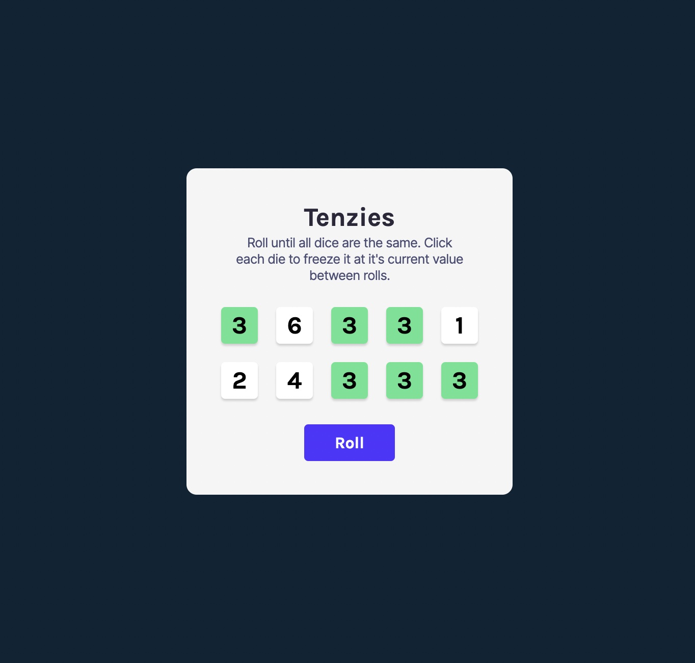

# Tenzies Game

This is another project from the Scrimba Learn React course.

## Table of contents

- [Overview](#overview)
  - [The challenge](#the-challenge)
  - [Screenshot](#screenshot)
  - [Links](#links)
- [My process](#my-process)
  - [Built with](#built-with)
  - [What I learned](#what-i-learned)
  - [Continued development](#continued-development)
  - [Useful resources](#useful-resources)
- [Author](#author)

## Overview

### The challenge

To build a game called Tenzies, where the player repeatedly rolls dice until they are all the same number. Each turn the user can choose dice to be held at their current value by clicking them. When all the dice are the same, a celebratory screen should show with falling confetti and the option to restart the game.

### Screenshot

### Links

- [Live site](https://jacob-dunbar.github.io/tenzies/)

## My process

### Built with

- [React](https://reactjs.org/) - JS library
- [Vite](https://vitejs.dev/) - development environment
- Nano ID library
- React Confetti package
- Figma
- Semantic HTML5 markup
- CSS
- CSS grid
- Flexbox

### What I learned

This project introduced me to so many exciting React concepts. We covered much of it in the course and in some smaller projects, but pulling it all together to produce a working game was very satisfying.

Effectively using hooks like useState and UseEffect; passing props to components; using .map() to render components and using third-party libraries are just some of the many techniques I learnt whilst completing this project.

I also got the chance to practice some of my vanilla javascript skills, like for loops, ternary operators and template literals. I even worked on my CSS grid skills.

Another thing this project got me practising was using comments to keep track of what I am doing in any given session. I can imagine how vital that would be on larger projects or when you are working with a team.

### Continued development

I used so many techniques for the first time during this project that I feel like I need to do another project using the same techniques to really cement them in my mind.

I used Vite again for this task but am curious about next.js so might look into that next.

I am also excited to learn about more hooks and would love to make a project that makes use of external APIs.

### Useful resources

- [scrimba - Learn React for Free ](www.https://scrimba.com/learn/learnreact) - This is the course I have been following and I have to say, it really is fantastic. This project is the last of many tasks set in the course, meaning it really 'gets your hands on the keyboard’. I have come out the other side not just with theoretical knowledge, but actual experience writing the code - and finished projects to show for it.

## Author

- Frontend Mentor - [@Jacob-Dunbar](https://www.frontendmentor.io/profile/Ja
